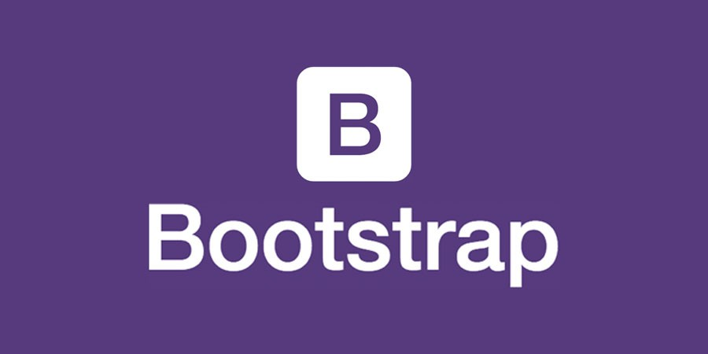
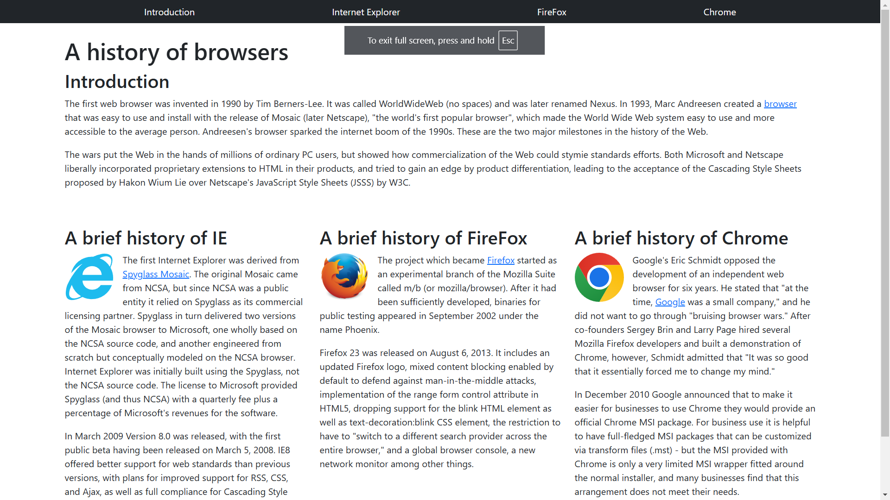

*"The right tool can make all the difference in achieving your goals."* - James Carpenter

In my software engineering class in college, we are currently learning how to make simple web pages using the widely known Hypertext Markup Language or HTML. Probably most of the web pages that you have ever visited on the internet have used the HTML language in some way or another. Before this unit I had a little bit of prior experience with HTML in high school, but the pages we are building now are much nicer and cleaner compared to the monstrosities I was making back then. Relearning the basics of HTML such as the syntax and some of the different features like classes and styling was simple enough to grasp, but applying these learnings to my own sites was another issue.

## (H)ow (T)o (M)ake Web Pages (L)ook Good?

One of things I liked about HTML was the amount of customizability it could support. Though it was hard to implement at times as we could control pretty much everything pertaining to the appearance, or style, of the page such as the spacing between elements, their color, text fonts, etc., it was nice knowing that I had the option to do much more if I wanted to. The use of classes and id's to hold certain styles was also good in limiting the total amount of clutter on the screen and forced me to have to plan ahead first before jumping in. This much freedom I felt was also a type of burden after being stuck not knowing which specific element to use in a scenario. Admittedly, art also isn't really in my wheelhouse.

  
   

  *Using HTML*
  
## Shiny New Tools

There are many different public tools out there called frameworks, that use HTML as a backbone, that can be added to these web pages in order to customize to their liking. One framework we are using in class right now is Bootstrap 5. Bootstrap 5 comes with pre-styled classes that do various things to the appearance. One such class 'content-justify-end' would make it so elements were placed to the right of the page. This made it easier to implement certain stylistic ideas we wanted. However, with more and more classes used, one of the main issues I was still having was getting lost with the use of all these different classes. Some elements were taking multiple classes and the amount of clutter on the screen made it so I would frequently lose where I was looking at and what elements were nested within another. Implementation was also an issue as I had a difficult time learning what all the classes were doing and what new elements to use when and where.

  
   

  *Using Bootstrap*

## Bootstrap + HTML

Though I think that Bootstrap and other frameworks can be great tools to use when designing web pages in HTML, I felt that learning how to use these frameworks was much more difficult than learning how to use HTML itself at first glance. It will definitely require some effort to grasp what is going on when using Bootstrap in conjunction with the HTML language in order to design web pages. In the end though, I feel learning how to use frameworks in conjunction with HTML will prove to be miles better and more time and effort efficient than designing everything from scratch using just HTML and a CSS style file. It would be well worth it to learn UI frameworks if learning how to design web pages were a goal of mine, however, it is not a personal goal, so I will leave that area to other software engineers.
