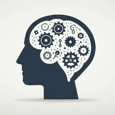

In the Software Engineering class (ICS 314) I am currently taking in college, we’ve been introduced to a new programming language: TypeScript. This builds on JavaScript, which itself is widely used for many applications in web development. TypeScript is also a language that builds on another programming language called Java which I have more experience with since it was used extensively in the introduction courses these past two semesters. The transition I experienced from having learnt Java to now having to learn JavaScript and TypeScript wasn't as difficult as learning Java for the first time (also my first ever programming language), but I still have some ways to go in order to improve my skills in developing software.

## What is a function?

Though Java is a high level programming language that can be easily understood in normal contexts, both TypeScript and JavaScript are much more simple to understand at a quick glance of the code. TypeScript uses just three primary data types which are numbers, strings, and boolean values. When working with the code I was able to quickly realize there really wasn't too much need for other data types as most problems could be solved in some way by the three aforementioned types. The creation of objects in TypeScript as compared to Java is also quite similar as there were just minor tweaks in the grammar/syntax of the languages. The best addition that TypeScript offered was the compile time type checking, where it will tell you if there is a mistake in your code as you are typing it out without having to run the code. This was helpful in the learning process and I can see it being helpful in future projects.

## Future in Software Engineering

This class uses the flipped classroom format where most student learning is done outside of class hours and class time is more of a collaboration. I personally am not a fan of this type of model for some subjects like math class or a science class, but in the context of the goals of the professors teaching the course, it makes sense. Their "Athletic Software Engineering" pedagogy aims to equip students with basic competency in modern software engineering technologies, and I feel being able to learn new skills and ideas on your own time is a good way to prepare students for jobs after school. The practice "Workout of the Day" that they provide is a small problem to test student competency in an area, and I feel they were helpful in showing me areas where I might need improvement and revisit my notes. Learning by doing, through actual coding rather than listening to lectures, has been far more engaging and effective.

Though my current plans for the future don't really involve software engineering, this class might change that. 
