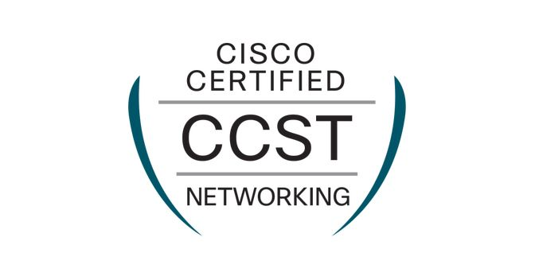

  

During my Summer Internship at the County of Kaua'i I found myself having a lot of free time as there wasm't much I was being tasked to do. To not waste that free time, I decided to pursue the Cisco Certified Support Technician certification in order to learn more about networking. I had heard about the certification from a mentor when I mentioned my interest in cybersecurity. He suggested first learning about networking as it is the foundation of everything that is connected. The learning material I chose started off really slow with basic background information about the internet and the history of the technology. However, once it started getting into more of the details of the technology behind these data networks and how it travels is when I got hooked.  

Over the course of about 8 weeks I was able to learn many of the basic concepts like the domain name system which converts website naems to their public IP addresses in order to connect users to the servers, technology like switches, wireless access points, and routers, and also some cybersecurity measures like firewalls. The test for the certification was easier than I had expected and I definitely felt overprepared after the fact. The next step I am hoping to take is getting the Cisco Certified Network Associate (CCNA) certification by the end of the Summer 2025.

The main takeway I took from this experience is finding out what I am capable of when I put my mind to something. The countless hours watching videos, reading the material, and taking notes felt all worth it at the end when I got my passing result back. This has also shown me how many hours there truly are in a day. Noramlly during Summer breaks time flew as I went through the motions of eating and sleeping all day with the excuse of relaxing. But choosing to study during all that free time showed me how valuable that free time was to learning more. I hope to take learn more this Summer as well.
