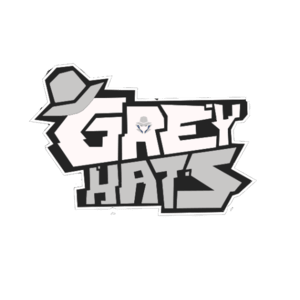

  
  

In the Spring and Fall semesters of 2024 I participated in capture the flag competitions through the National Cyber League's competition (NCL). A capture the flag competition is a type of competition designed as a learning and challenge-based activity for those interested in hacking and cybersecurity. In order to score points players have to find a key or "flag" that would be the answer to prompts provided by the organizers. This competition involves teams registered from all over the U.S. The NCL competition was split up between the team competition and the individual competition over two weekends. During the Spring semester I only participated in the team game, but in the Fall I did both the individual and team game. 

In order to prepare for the competition, the Grey Hats cybersecurity club I am a part of held a one-week long training session. In order to get familiar with some tools that would be useful during the competition they were first introduced through a slideshow, then we got to use them to solve some practice problems. We got some pointers on some Linux tools like hashcat and johntheripper that were used for password cracking, gdb for some reverse engineering, Wireshark to inspect packets on the network, and others. 

Thanks to the training and the help of Google and ChatGPT our team was most recently able to get 53rd in the nation in the graduate student division, and I was able to get top 1000 in the individual game. Hopefully next semester I can improve and aim for top 500 because the top 500 players get a special coin mailed to them. I learned a lot both from the training and actually competing and hope to get more out of these types of competitions in the future
