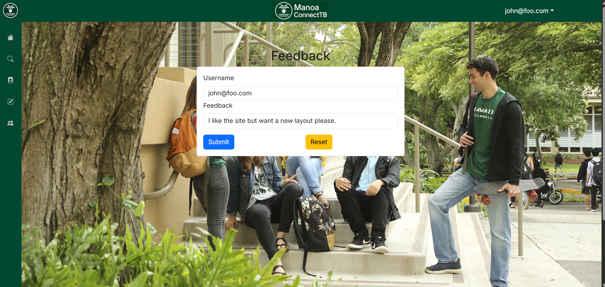

# Overview #
In our Software Engineering class, we were tasked with creating a functional website as a final group project. Our group chose to create a club finding website called [Manoa Connect](https://manoa-connect.vercel.app/). Our goal was to create a club finder with a similar feel to social media where  we could connect students at the University of Hawai‘i at Mānoa with the many amazing clubs, student organizations, and communities on campus. We aimed to implement features such as filtering, following and posting in order to make it more similar to social media. 

# My Contributions #
For the project, my main contributions dealt with the sidebar, the feedback page, and being the main updater of the project's [home page](https://manoaconnecttb.github.io/). The sidebar was our main navigation tool for going between the pages of our website. The feedback page was designed to collect user feedback and store it in the database in order to be seen by the site admins, AKA our group of developers. The project home page is a collection of the progress we have made throughout the entire process and gives an overview of why we created ManoaConnect and what it does. 
 
## Feedback Page ##
 

 

# Takeaways #
Throughout the process, I've had many new and exciting experiences, which also came with **MANY** frustrations. While developing the sidebar, I was having trouble with a lot of the HTML formatting and would often have to resort to searching up how to do a lot of formatting options such as having the sidebar slide out when the user hovered over it. The whole experience trying to figure it out made me want to pull my hair out at every step of the way except when it was done and looked great. Creating the feedback page was actually easier than making the sidebar as the template did most of the work and I just had to change how it looked to fit my needs. The harder part about the feedback page was connecting it to the database, which was simple enough after reading some documentation and using my trust Google search and ChatGPT prompting skills. Overall, the database process was more fun to me when compared to creating the sidebar.

Outside of the creation of website components, I had a great experience with the site creation process and working with a team to create it. The issue-driven project management organizational methods we used during the creation of the site made it easy for us developers to stay organized with what tasks still needed to be done, how they should be done, and who would do them. It made splitting work between group members and completing work easy for all of us. I hope to continue to utilize some form of issue driven project management in the future as this experience was less stressful when everything was already laid out beforehand.

[Github Organization](https://github.com/manoaconnecttb)
